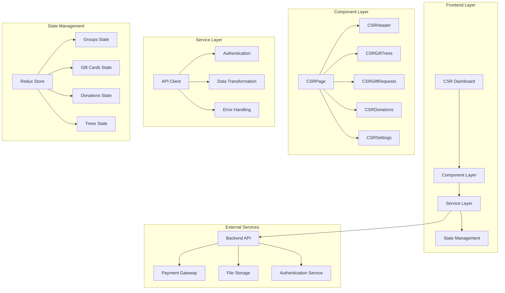
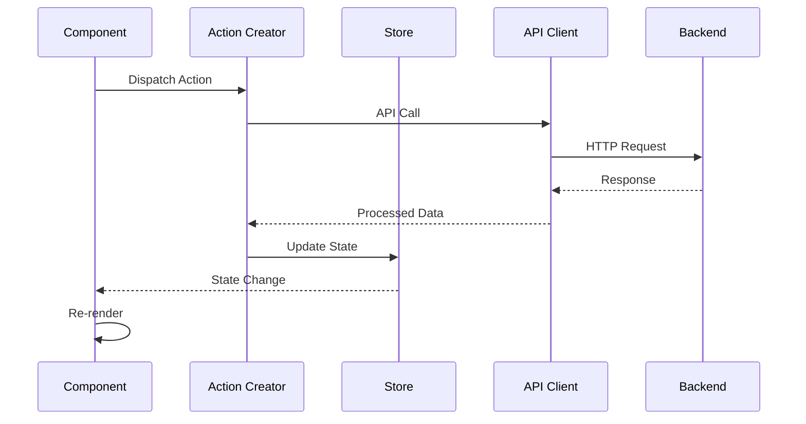
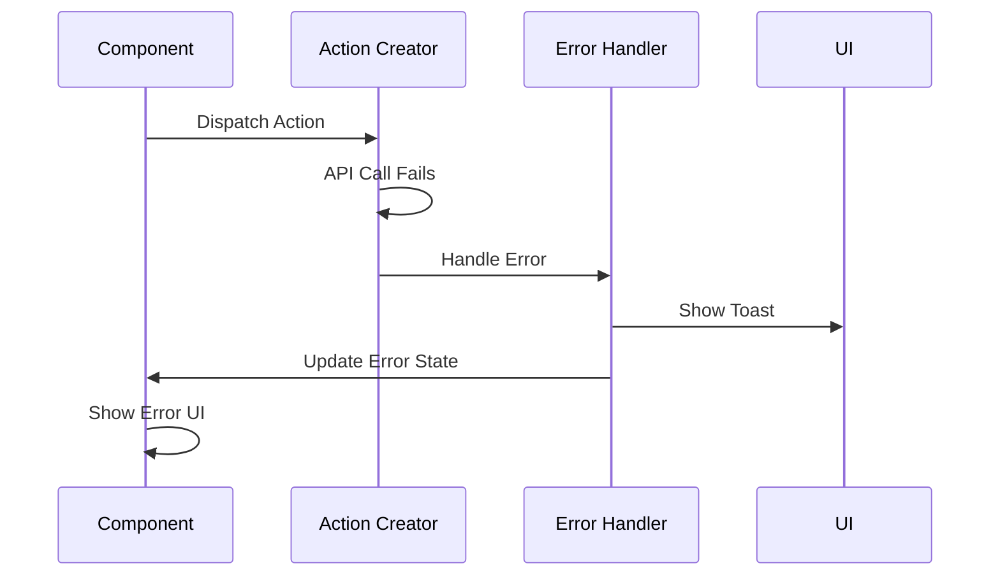

# CSR Technical Architecture Documentation

## Overview

This document provides a comprehensive technical overview of the CSR (Corporate Social Responsibility) module's frontend architecture, including design patterns, data flow, state management, and integration strategies.

## Architecture Principles

### 1. Component-Based Architecture
- **Modular Design**: Each feature is encapsulated in dedicated components
- **Reusability**: Common components shared across features
- **Separation of Concerns**: Clear separation between UI, business logic, and data management
- **Single Responsibility**: Each component has a focused purpose

### 2. Unidirectional Data Flow
- **Redux Pattern**: Centralized state management with predictable data flow
- **Props Down, Events Up**: Parent components pass data down, children emit events up
- **Immutable State**: State updates through pure functions

### 3. Responsive Design
- **Mobile-First**: Designed for mobile devices, enhanced for desktop
- **Breakpoint System**: Material-UI breakpoint system for responsive layouts
- **Adaptive UI**: Components adapt to screen size and device capabilities

## System Architecture



## Component Architecture

### 1. Container Components

#### CSRPage (Main Container)
```typescript
// Primary responsibilities:
// - Route management and authentication
// - Tab navigation state
// - Group context management
// - Layout orchestration

interface CSRPageState {
  activeTab: string;
  currentGroup: Group | null;
  loading: boolean;
  status: { code: number; message: string };
}
```

#### Feature Containers
- **CSRGiftTrees**: Green Tribute Wall management
- **CSRGiftRequests**: Pre-purchase system
- **CSRDonations**: Donation management
- **CSRSettings**: Organization configuration

### 2. Presentation Components

#### Shared UI Components
```typescript
// Reusable components across CSR module
interface SharedComponents {
  CSRHeader: HeaderComponent;
  GeneralTable: TableComponent;
  PaymentDialog: PaymentComponent;
  FileUploadField: UploadComponent;
  AutocompleteWithPagination: SearchComponent;
}
```

#### Form Components
```typescript
// Multi-step form architecture
interface FormComponents {
  PurchaseTreesForm: MultiStepForm;
  DonateTreesForm: SingleStepForm;
  CSRForm: BaseForm;
}

// Form step structure
interface FormStep {
  title: string;
  component: React.ComponentType;
  validation: ValidationSchema;
  data: StepData;
}
```

### 3. Component Communication Patterns

#### Props Interface Pattern
```typescript
// Standardized props interface
interface ComponentProps {
  // Data props
  data?: any;
  loading?: boolean;
  error?: string;
  
  // Event handlers
  onSuccess?: () => void;
  onError?: (error: string) => void;
  onChange?: (data: any) => void;
  
  // Configuration
  config?: ComponentConfig;
  theme?: ThemeConfig;
}
```

#### Event Handling Pattern
```typescript
// Consistent event handling
const handleAction = useCallback(async (data: ActionData) => {
  try {
    setLoading(true);
    const result = await apiCall(data);
    onSuccess?.(result);
    toast.success('Action completed successfully');
  } catch (error) {
    onError?.(error.message);
    toast.error(error.message);
  } finally {
    setLoading(false);
  }
}, [onSuccess, onError]);
```

## State Management Architecture

### 1. Redux Store Structure

```typescript
interface RootState {
  // CSR-specific state
  groupsData: GroupsDataState;
  giftCardsData: GiftCardsDataState;
  donationsData: DonationsDataState;
  treesData: TreesDataState;
  
  // Shared state
  auth: AuthState;
  ui: UIState;
  cache: CacheState;
}
```

### 2. State Slices

#### Groups State
```typescript
interface GroupsDataState {
  loading: boolean;
  totalGroups: number;
  groups: Record<string, Group>;
  paginationMapping: Record<number, number>;
  error?: string;
}

// Actions
const groupsSlice = createSlice({
  name: 'groups',
  initialState,
  reducers: {
    setLoading: (state, action) => {
      state.loading = action.payload;
    },
    setGroups: (state, action) => {
      state.groups = action.payload.groups;
      state.totalGroups = action.payload.total;
    },
    updatePaginationMapping: (state, action) => {
      state.paginationMapping = { ...state.paginationMapping, ...action.payload };
    }
  }
});
```

#### Gift Cards State
```typescript
interface GiftCardsDataState {
  loading: boolean;
  totalGiftCards: number;
  giftCards: Record<string, GiftCard>;
  paginationMapping: Record<number, number>;
  filters: Record<string, GridFilterItem>;
  orderBy: Order[];
}
```

### 3. Action Creators

```typescript
// Async action creators using Redux Toolkit
export const getGroups = createAsyncThunk(
  'groups/getGroups',
  async ({ offset, limit, filters, orderBy }: GetGroupsParams) => {
    const apiClient = new ApiClient();
    const response = await apiClient.getGroups(offset, limit, filters, orderBy);
    return response;
  }
);

// Usage in components
const dispatch = useAppDispatch();
const { getGroups } = bindActionCreators(groupActionCreators, dispatch);

useEffect(() => {
  getGroups(page * pageSize, pageSize, filters, orderBy);
}, [page, pageSize, filters, orderBy]);
```

## Data Flow Architecture

### 1. Request Flow



### 2. Error Flow



### 3. Caching Strategy

#### Memory Caching
```typescript
// Redux store acts as memory cache
interface CacheState {
  groups: {
    data: Record<string, Group>;
    lastFetch: number;
    ttl: number;
  };
  trees: {
    data: Record<string, Tree[]>;
    lastFetch: number;
    ttl: number;
  };
}

// Cache validation
const isCacheValid = (lastFetch: number, ttl: number) => {
  return Date.now() - lastFetch < ttl;
};
```

#### Pagination Caching
```typescript
// Efficient pagination through mapping
interface PaginationMapping {
  [index: number]: number; // index -> record ID
}

// Usage
const getRecordAtIndex = (index: number) => {
  const recordId = paginationMapping[index];
  return records[recordId];
};
```

## API Integration Architecture

### 1. API Client Design

```typescript
class ApiClient {
  private baseURL: string;
  private authToken: string;
  
  constructor() {
    this.baseURL = process.env.REACT_APP_API_BASE_URL;
    this.authToken = localStorage.getItem('authToken');
  }
  
  // Request interceptor
  private async request<T>(config: RequestConfig): Promise<T> {
    const headers = {
      'Content-Type': 'application/json',
      'Authorization': `Bearer ${this.authToken}`,
      ...config.headers
    };
    
    try {
      const response = await fetch(`${this.baseURL}${config.url}`, {
        method: config.method,
        headers,
        body: config.data ? JSON.stringify(config.data) : undefined
      });
      
      if (!response.ok) {
        throw new Error(`HTTP ${response.status}: ${response.statusText}`);
      }
      
      return await response.json();
    } catch (error) {
      this.handleError(error);
      throw error;
    }
  }
  
  // Error handling
  private handleError(error: any) {
    if (error.status === 401) {
      // Handle authentication error
      this.redirectToLogin();
    } else if (error.status >= 500) {
      // Handle server error
      toast.error('Server error occurred. Please try again later.');
    }
  }
}
```

### 2. Data Transformation Layer

```typescript
// Transform API responses to frontend models
class DataTransformer {
  static transformGroup(apiGroup: ApiGroup): Group {
    return {
      id: apiGroup.id,
      name: apiGroup.name,
      type: apiGroup.type,
      description: apiGroup.description,
      logo_url: apiGroup.logo_url,
      address: apiGroup.address,
      billing_email: apiGroup.billing_email,
      created_at: new Date(apiGroup.created_at),
      updated_at: new Date(apiGroup.updated_at),
      sponsored_trees: apiGroup.sponsored_trees || 0
    };
  }
  
  static transformGiftCard(apiGiftCard: ApiGiftCard): GiftCard {
    return {
      id: apiGiftCard.id,
      no_of_cards: apiGiftCard.no_of_cards,
      created_by_name: apiGiftCard.created_by_name,
      status: this.transformStatus(apiGiftCard.status),
      total_amount: apiGiftCard.total_amount,
      amount_received: apiGiftCard.amount_received,
      payment_status: apiGiftCard.payment_status,
      created_at: new Date(apiGiftCard.created_at)
    };
  }
}
```

## Form Architecture

### 1. Multi-Step Form Pattern

```typescript
interface MultiStepFormProps {
  steps: FormStep[];
  initialData?: any;
  onSubmit: (data: any) => Promise<void>;
  onCancel: () => void;
}

const MultiStepForm: React.FC<MultiStepFormProps> = ({
  steps,
  initialData,
  onSubmit,
  onCancel
}) => {
  const [currentStep, setCurrentStep] = useState(0);
  const [formData, setFormData] = useState(initialData || {});
  const [loading, setLoading] = useState(false);
  
  const handleNext = async () => {
    const isValid = await validateStep(currentStep, formData);
    if (isValid) {
      setCurrentStep(prev => prev + 1);
    }
  };
  
  const handleSubmit = async () => {
    setLoading(true);
    try {
      await onSubmit(formData);
    } catch (error) {
      toast.error(error.message);
    } finally {
      setLoading(false);
    }
  };
  
  return (
    <Dialog open maxWidth="md" fullWidth>
      <DialogTitle>
        <Steps current={currentStep}>
          {steps.map(step => (
            <Steps.Step key={step.title} title={step.title} />
          ))}
        </Steps>
      </DialogTitle>
      
      <DialogContent>
        {React.createElement(steps[currentStep].component, {
          data: formData,
          onChange: setFormData
        })}
      </DialogContent>
      
      <DialogActions>
        <Button onClick={onCancel}>Cancel</Button>
        {currentStep > 0 && (
          <Button onClick={() => setCurrentStep(prev => prev - 1)}>
            Previous
          </Button>
        )}
        {currentStep < steps.length - 1 ? (
          <Button onClick={handleNext} variant="contained">
            Next
          </Button>
        ) : (
          <LoadingButton
            onClick={handleSubmit}
            loading={loading}
            variant="contained"
          >
            Submit
          </LoadingButton>
        )}
      </DialogActions>
    </Dialog>
  );
};
```

### 2. Form Validation Architecture

```typescript
// Validation schema using Yup
const purchaseFormSchema = yup.object({
  treesCount: yup
    .number()
    .min(1, 'Minimum 1 tree required')
    .max(1000, 'Maximum 1000 trees allowed')
    .required('Tree count is required'),
  
  corporateDetails: yup.object({
    name: yup.string().required('Corporate name is required'),
    email: yup.string().email('Invalid email').required('Email is required')
  }),
  
  paymentMethod: yup
    .string()
    .oneOf(['online', 'manual'], 'Invalid payment method')
    .required('Payment method is required')
});

// Form validation hook
const useFormValidation = (schema: yup.Schema) => {
  const [errors, setErrors] = useState<Record<string, string>>({});
  
  const validate = async (data: any) => {
    try {
      await schema.validate(data, { abortEarly: false });
      setErrors({});
      return true;
    } catch (error) {
      const validationErrors: Record<string, string> = {};
      error.inner.forEach((err: any) => {
        validationErrors[err.path] = err.message;
      });
      setErrors(validationErrors);
      return false;
    }
  };
  
  return { errors, validate };
};
```

## Performance Architecture

### 1. Component Optimization

```typescript
// Memoization patterns
const ExpensiveComponent = React.memo(({ data, onAction }) => {
  const processedData = useMemo(() => {
    return data.map(item => processItem(item));
  }, [data]);
  
  const handleAction = useCallback((id: string) => {
    onAction(id);
  }, [onAction]);
  
  return (
    <div>
      {processedData.map(item => (
        <ItemComponent
          key={item.id}
          item={item}
          onAction={handleAction}
        />
      ))}
    </div>
  );
});

// Virtualization for large lists
const VirtualizedTable = ({ data, rowHeight = 50 }) => {
  return (
    <FixedSizeList
      height={600}
      itemCount={data.length}
      itemSize={rowHeight}
      itemData={data}
    >
      {({ index, style, data }) => (
        <div style={style}>
          <TableRow data={data[index]} />
        </div>
      )}
    </FixedSizeList>
  );
};
```

### 2. Lazy Loading Strategy

```typescript
// Code splitting with React.lazy
const CSRGiftTrees = React.lazy(() => import('./CSRGiftTrees'));
const CSRDonations = React.lazy(() => import('./CSRDonations'));
const CSRSettings = React.lazy(() => import('./CSRSettings'));

// Usage with Suspense
const CSRPage = () => {
  return (
    <Suspense fallback={<Spinner />}>
      {activeTab === 'greenTributeWall' && <CSRGiftTrees />}
      {activeTab === 'donations' && <CSRDonations />}
      {activeTab === 'settings' && <CSRSettings />}
    </Suspense>
  );
};
```

### 3. Data Loading Optimization

```typescript
// Debounced API calls
const useDebouncedApi = (apiCall: Function, delay: number = 300) => {
  const [loading, setLoading] = useState(false);
  const [data, setData] = useState(null);
  const [error, setError] = useState(null);
  
  const debouncedCall = useMemo(
    () => debounce(async (...args) => {
      setLoading(true);
      setError(null);
      
      try {
        const result = await apiCall(...args);
        setData(result);
      } catch (err) {
        setError(err);
      } finally {
        setLoading(false);
      }
    }, delay),
    [apiCall, delay]
  );
  
  return { loading, data, error, call: debouncedCall };
};

// Usage
const { loading, data, call } = useDebouncedApi(apiClient.searchGroups);

useEffect(() => {
  call(searchTerm);
}, [searchTerm, call]);
```

## Security Architecture

### 1. Authentication Flow

```typescript
// Authentication context
interface AuthContextType {
  user: User | null;
  token: string | null;
  login: (credentials: LoginCredentials) => Promise<void>;
  logout: () => void;
  isAuthenticated: boolean;
  hasRole: (role: string) => boolean;
}

const AuthProvider: React.FC = ({ children }) => {
  const [user, setUser] = useState<User | null>(null);
  const [token, setToken] = useState<string | null>(
    localStorage.getItem('authToken')
  );
  
  const login = async (credentials: LoginCredentials) => {
    const response = await authApi.login(credentials);
    setUser(response.user);
    setToken(response.token);
    localStorage.setItem('authToken', response.token);
  };
  
  const logout = () => {
    setUser(null);
    setToken(null);
    localStorage.removeItem('authToken');
  };
  
  const hasRole = (role: string) => {
    return user?.roles?.includes(role) || false;
  };
  
  return (
    <AuthContext.Provider value={{
      user,
      token,
      login,
      logout,
      isAuthenticated: !!token,
      hasRole
    }}>
      {children}
    </AuthContext.Provider>
  );
};
```

### 2. Route Protection

```typescript
// Protected route component
const RequireAuth: React.FC<{ children: React.ReactNode; roles?: string[] }> = ({
  children,
  roles = []
}) => {
  const { isAuthenticated, hasRole } = useAuth();
  const location = useLocation();
  
  if (!isAuthenticated) {
    return <Navigate to="/login" state={{ from: location }} replace />;
  }
  
  if (roles.length > 0 && !roles.some(role => hasRole(role))) {
    return <Navigate to="/unauthorized" replace />;
  }
  
  return <>{children}</>;
};

// Usage
<Route
  path="/csr/dashboard/:groupId"
  element={
    <RequireAuth roles={['Admin', 'SuperAdmin']}>
      <CSRPage />
    </RequireAuth>
  }
/>
```

### 3. Input Sanitization

```typescript
// Input sanitization utilities
class SecurityUtils {
  static sanitizeInput(input: string): string {
    return input
      .replace(/<script\b[^<]*(?:(?!<\/script>)<[^<]*)*<\/script>/gi, '')
      .replace(/javascript:/gi, '')
      .replace(/on\w+\s*=/gi, '');
  }
  
  static validateEmail(email: string): boolean {
    const emailRegex = /^[^\s@]+@[^\s@]+\.[^\s@]+$/;
    return emailRegex.test(email);
  }
  
  static validatePhoneNumber(phone: string): boolean {
    const phoneRegex = /^\+?[\d\s\-\(\)]+$/;
    return phoneRegex.test(phone);
  }
}

// Usage in forms
const handleInputChange = (value: string) => {
  const sanitizedValue = SecurityUtils.sanitizeInput(value);
  setFormData(prev => ({ ...prev, field: sanitizedValue }));
};
```

## Testing Architecture

### 1. Component Testing Strategy

```typescript
// Component test example
describe('CSRGiftTrees', () => {
  const mockProps = {
    selectedGroup: mockGroup,
    groupId: 1
  };
  
  beforeEach(() => {
    jest.clearAllMocks();
  });
  
  it('renders gift trees grid', () => {
    render(<CSRGiftTrees {...mockProps} />);
    expect(screen.getByText('Green Tribute Wall')).toBeInTheDocument();
  });
  
  it('handles tree selection', async () => {
    const mockOnSelect = jest.fn();
    render(<CSRGiftTrees {...mockProps} onTreeSelect={mockOnSelect} />);
    
    const treeCard = screen.getByTestId('tree-card-1');
    fireEvent.click(treeCard);
    
    expect(mockOnSelect).toHaveBeenCalledWith(expect.objectContaining({
      id: 1
    }));
  });
  
  it('filters trees correctly', async () => {
    render(<CSRGiftTrees {...mockProps} />);
    
    const filterRadio = screen.getByLabelText('Show Gifted Trees');
    fireEvent.click(filterRadio);
    
    await waitFor(() => {
      expect(screen.queryByTestId('available-tree')).not.toBeInTheDocument();
    });
  });
});
```

### 2. Integration Testing

```typescript
// API integration test
describe('CSR API Integration', () => {
  it('fetches and displays groups', async () => {
    const mockGroups = [
      { id: 1, name: 'Test Group 1' },
      { id: 2, name: 'Test Group 2' }
    ];
    
    jest.spyOn(apiClient, 'getGroups').mockResolvedValue({
      results: mockGroups,
      total: 2
    });
    
    render(<CSRHeader groupId={undefined} onGroupChange={jest.fn()} />);
    
    await waitFor(() => {
      expect(screen.getByText('Test Group 1')).toBeInTheDocument();
      expect(screen.getByText('Test Group 2')).toBeInTheDocument();
    });
  });
});
```

## Deployment Architecture

### 1. Build Configuration

```typescript
// Environment-specific configuration
interface EnvironmentConfig {
  API_BASE_URL: string;
  RAZORPAY_KEY: string;
  AWS_REGION: string;
  AWS_BUCKET: string;
  SENTRY_DSN?: string;
  ANALYTICS_ID?: string;
}

const config: EnvironmentConfig = {
  API_BASE_URL: process.env.REACT_APP_API_BASE_URL || 'http://localhost:3001',
  RAZORPAY_KEY: process.env.REACT_APP_RAZORPAY_KEY || '',
  AWS_REGION: process.env.REACT_APP_AWS_REGION || 'us-east-1',
  AWS_BUCKET: process.env.REACT_APP_AWS_BUCKET || '',
  SENTRY_DSN: process.env.REACT_APP_SENTRY_DSN,
  ANALYTICS_ID: process.env.REACT_APP_ANALYTICS_ID
};
```

### 2. Performance Monitoring

```typescript
// Performance monitoring setup
import { getCLS, getFID, getFCP, getLCP, getTTFB } from 'web-vitals';

const sendToAnalytics = (metric: any) => {
  // Send to analytics service
  if (config.ANALYTICS_ID) {
    gtag('event', metric.name, {
      event_category: 'Web Vitals',
      value: Math.round(metric.value),
      event_label: metric.id,
    });
  }
};

// Measure Core Web Vitals
getCLS(sendToAnalytics);
getFID(sendToAnalytics);
getFCP(sendToAnalytics);
getLCP(sendToAnalytics);
getTTFB(sendToAnalytics);
```

This technical architecture provides a robust, scalable, and maintainable foundation for the CSR module, ensuring optimal performance, security, and user experience across all features and use cases.