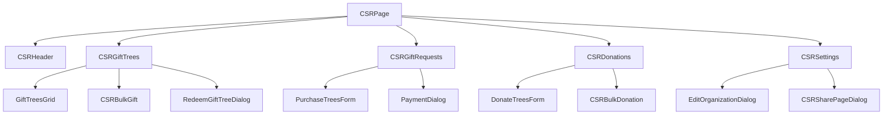

# CSR Components Documentation

## Core Components

### CSRPage
**Location:** `src/pages/admin/csr/CSRPage.tsx`

The main dashboard component that orchestrates the entire CSR experience.

#### Props
```typescript
// No external props - uses URL parameters
```

#### State Management
```typescript
const [activeTab, setActiveTab] = useState<string>("greenTributeWall");
const [currentGroup, setCurrentGroup] = useState<Group | null>(null);
const [loading, setLoading] = useState(true);
const [status, setStatus] = useState<{ code: number; message: string }>();
```

#### Key Features
- **Tab Navigation**: Manages switching between different CSR sections
- **Authentication**: Handles user authentication and role-based access
- **Group Context**: Maintains selected corporate group context
- **Responsive Layout**: Adapts to mobile and desktop viewports

#### Navigation Items
```typescript
const items = [
  {
    displayName: "Green Tribute Wall",
    logo: NaturePeople,
    onClick: () => setActiveTab("greenTributeWall")
  },
  {
    displayName: 'Pre-Purchase',
    logo: CardGiftcard,
    onClick: () => setActiveTab("prePurchase")
  },
  {
    displayName: 'Gift History',
    logo: History,
    onClick: () => setActiveTab("giftHistory")
  },
  {
    displayName: 'Donations',
    logo: VolunteerActivism,
    onClick: () => setActiveTab("donations")
  },
  {
    displayName: "Corporate Settings",
    logo: Settings,
    onClick: () => setActiveTab("Setting-Details")
  }
];
```

---

### CSRHeader
**Location:** `src/pages/admin/csr/CSRHeader.tsx`

Provides the header section with organization selection and branding.

#### Props
```typescript
interface Props {
  groupId: any;
  onGroupChange: (group: Group | null) => void;
}
```

#### Features
- **Group Selection**: Autocomplete dropdown for selecting corporate groups
- **Logo Display**: Shows organization logo when available
- **Share Functionality**: Integrates CSRSharePageDialog for sharing dashboard
- **Responsive Design**: Adapts layout for mobile devices

#### Key Methods
```typescript
const getGroupsData = async () => {
  const groupNameFilter = {
    columnField: "name",
    value: groupNameInput,
    operatorValue: "contains",
  };
  // Fetch groups with filters
};
```

---

### CSRGiftTrees
**Location:** `src/pages/admin/csr/CSRGiftTrees.tsx`

Manages the Green Tribute Wall functionality for displaying and managing tree gifts.

#### Props
```typescript
interface CSRGiftTreesProps {
  selectedGroup: Group;
  groupId: number;
}
```

#### State Management
```typescript
const [giftDialogVisible, setGiftDialogVisible] = useState(false);
const [selectedGiftTree, setSelectedGiftTree] = useState<Tree | null>(null);
const [availableTrees, setAvailableTrees] = useState(0);
const [filter, setFilter] = useState<'gifted' | 'non-gifted' | 'all'>('all');
const [searchUser, setSeachUser] = useState('');
const [bulkGifting, setBulkGifting] = useState(false);
```

#### Key Features
- **Tree Grid Display**: Shows trees in a responsive grid layout
- **Filtering System**: Filter trees by status (gifted/non-gifted/all)
- **Search Functionality**: Search trees by recipient name
- **Individual Gifting**: Gift single trees through dialog
- **Bulk Gifting**: Mass gift trees using CSV or manual entry
- **Analytics Integration**: Shows gift statistics and metrics

#### Filter Options
```typescript
<FormControlLabel
  value="non-gifted"
  control={<Radio color="success" />}
  label="Show Available Trees"
/>
<FormControlLabel
  value="gifted"
  control={<Radio color="success" />}
  label="Show Gifted Trees"
/>
<FormControlLabel
  value="all"
  control={<Radio color="success" />}
  label="Show All"
/>
```

---

### CSRGiftRequests
**Location:** `src/pages/admin/csr/CSRGiftRequests.tsx`

Handles pre-purchase tree requests and order management.

#### Props
```typescript
interface CSRGiftRequestsProps {
  groupId: number;
  selectedGroup: Group;
}
```

#### State Management
```typescript
const [page, setPage] = useState(0);
const [pageSize, setPageSize] = useState(10);
const [filters, setFilters] = useState<Record<string, GridFilterItem>>({});
const [orderBy, setOrderBy] = useState<Order[]>([]);
const [tableRows, setTableRows] = useState<GiftCard[]>([]);
const [formOpen, setFormOpen] = useState(false);
```

#### Table Columns
```typescript
const columns: TableColumnsType<GiftCard> = [
  {
    dataIndex: "id",
    key: "Req. No.",
    title: "Req. No.",
    align: "right",
    width: 100,
    fixed: 'left',
  },
  {
    dataIndex: "no_of_cards",
    key: "# Trees",
    title: getSortableHeader("# Trees", 'no_of_cards'),
    align: "center",
    width: 100,
  },
  {
    dataIndex: "created_by_name",
    key: "Created by",
    title: "Created by",
    align: "center",
    width: 200,
    ...getColumnSearchProps('created_by_name', filters, handleSetFilters)
  },
  // ... more columns
];
```

#### Key Features
- **Request Management**: View and manage tree purchase requests
- **Status Tracking**: Monitor request status (Pending/Allocated)
- **Payment Integration**: Handle payment processing
- **Filtering & Sorting**: Advanced table filtering and sorting
- **Export Functionality**: Download request data

---

### CSRDonations
**Location:** `src/pages/admin/csr/CSRDonations.tsx`

Manages donation campaigns and tracking.

#### Props
```typescript
interface CSRDonationsProps {
  selectedGroup: Group;
}
```

#### Key Features
- **Donation Analytics**: Visual analytics dashboard
- **Donation History**: Tabular view of all donations
- **Bulk Assignment**: Assign trees to multiple recipients
- **Payment Processing**: Handle donation payments
- **Status Monitoring**: Track completion status

#### Bulk Assignment Flow
```typescript
const handleBulkSubmit = async (recipients: any[]) => {
  setIsSubmitting(true);
  setBulkError(null);
  
  const updatedRecipients = recipients.map(item => {
    // Process recipient data
    item.recipient_name = item.recipient_name?.trim();
    item.assignee_name = item.assignee_name?.trim() || item.recipient_name;
    // Generate email if not provided
    item.recipient_email = item.recipient_email?.trim() 
      ? item.recipient_email?.trim()
      : generateEmail(item.recipient_name, userName);
    return item;
  });

  try {
    await apiClient.bulkAssignTreesToDonationUsers(selectedGroup.id, updatedRecipients);
    toast.success('Trees assigned successfully!');
    setBulkDialogOpen(false);
    getDonationData();
  } catch (error) {
    setBulkError(error.message);
    toast.error(error.message);
  } finally {
    setIsSubmitting(false);
  }
};
```

---

### CSRSettings
**Location:** `src/pages/admin/csr/CSRSettings.tsx`

Organization configuration and user management.

#### Props
```typescript
interface Props {
  group: Group;
  onGroupChange: (group: Group) => void;
}
```

#### Key Features
- **Organization Profile**: Edit organization details and logo
- **User Management**: Add/remove users from dashboard access
- **Logo Upload**: AWS S3 integration for logo uploads
- **Share Functionality**: Generate shareable dashboard links

#### Organization Update Flow
```typescript
const handleSaveOrganization = async (
  updatedData: { name: string; address: string; logo_url: string | null, billing_email: string; },
  logoFile?: File
) => {
  try {
    if (logoFile) {
      const awsUtil = new AWSUtils();
      const url = await awsUtil.uploadFileToS3("gift-request", logoFile, "logos");
      updatedData.logo_url = url;
    }

    const updatedGroup = {
      ...group,
      ...updatedData,
      updated_at: new Date()
    };

    const response = await apiClient.updateGroup(updatedGroup);
    onGroupChange(response);
    toast.success("Organization updated successfully!");
  } catch (error) {
    toast.error("Failed to update organization");
  }
};
```

---

## Form Components

### PurchaseTreesForm
**Location:** `src/pages/admin/csr/form/PurchaseTreesForm.tsx`

Multi-step form for purchasing trees.

#### Props
```typescript
interface Props {
  open: boolean;
  onClose: () => void;
  corporateName?: string;
  corporateLogo?: string;
  userName?: string;
  userEmail?: string;
  groupId?: number;
  onSuccess?: () => void;
}
```

#### Form Steps
1. **Tree Count Selection**: Choose number of trees to purchase
2. **Purchase Summary**: Review order details and pricing
3. **Payment**: Process payment through Razorpay or upload proof

### DonateTreesForm
**Location:** `src/pages/admin/csr/form/DonateTreesForm.tsx`

Form for creating donation campaigns.

#### Key Features
- **Donation Amount**: Specify donation amount
- **Tree Count**: Calculate trees based on donation
- **Payment Integration**: Process donations
- **Campaign Details**: Add campaign information

---

## Bulk Operations Components

### CSRBulkGift
**Location:** `src/pages/admin/csr/CSRBulkGift.tsx`

Handles bulk tree gifting operations.

#### Features
- **CSV Upload**: Upload recipient data via CSV
- **Manual Entry**: Add recipients manually
- **Data Validation**: Validate recipient information
- **Batch Processing**: Process multiple gifts simultaneously

### CSRBulkDonation
**Location:** `src/pages/admin/csr/CSRBulkDonation.tsx`

Manages bulk donation assignments.

#### Features
- **Recipient Management**: Add multiple donation recipients
- **Tree Assignment**: Assign trees to recipients
- **Validation**: Ensure data integrity
- **Progress Tracking**: Monitor assignment progress

---

## Utility Components

### CSRSharePageDialog
**Location:** `src/pages/admin/csr/CSRSharePageDialog.tsx`

Provides functionality to share dashboard access.

#### Features
- **User Addition**: Add users to dashboard access
- **Link Generation**: Create shareable dashboard links
- **Permission Management**: Control access levels

### EditOrganizationDialog
**Location:** `src/pages/admin/csr/EditOrganizationDialog.tsx`

Modal dialog for editing organization details.

#### Features
- **Form Validation**: Validate organization data
- **Logo Upload**: Handle logo file uploads
- **Real-time Preview**: Show changes before saving

### PaymentDialog
**Location:** `src/pages/admin/csr/components/PaymentDialog.tsx`

Handles payment processing for gifts and donations.

#### Features
- **Razorpay Integration**: Online payment processing
- **Payment Proof Upload**: Manual payment verification
- **Status Tracking**: Monitor payment status

---

## Component Interaction Flow



This component architecture ensures modularity, reusability, and maintainability while providing a comprehensive CSR management system.