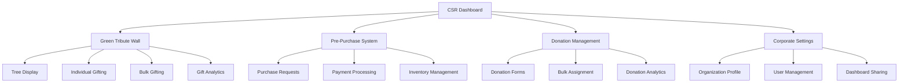

# CSR Features Documentation

## Overview

The CSR (Corporate Social Responsibility) module provides comprehensive features for organizations to manage their environmental impact through tree sponsorship, donations, and gift programs. This document details each feature's functionality, user workflows, and technical implementation.

## Feature Categories

### 1. Green Tribute Wall
### 2. Pre-Purchase System
### 3. Donation Management
### 4. Corporate Settings
### 5. Analytics & Reporting
### 6. User Management

---

## 1. Green Tribute Wall

**Primary Component:** `CSRGiftTrees.tsx`

The Green Tribute Wall is the centerpiece of the CSR dashboard, showcasing all trees gifted by the organization as a visual tribute to their environmental contributions.

### 1.1 Tree Display & Visualization

#### Tree Grid Layout
- **Responsive Grid**: Adapts to screen size (mobile/tablet/desktop)
- **Tree Cards**: Each tree displayed as an individual card with:
  - Tree image
  - Recipient information
  - Gift message
  - Location details
  - Gifting date
  - QR code for tree profile

#### Visual States
```typescript
// Tree card states
interface TreeCardState {
  gifted: boolean;        // Tree has been gifted
  available: boolean;     // Tree available for gifting
  pending: boolean;       // Gift transaction in progress
  verified: boolean;      // Gift transaction verified
}
```

### 1.2 Filtering & Search

#### Filter Options
- **Show Available Trees**: Display only trees available for gifting
- **Show Gifted Trees**: Display only trees that have been gifted
- **Show All**: Display all trees regardless of status

#### Search Functionality
- **Search by Recipient Name**: Find trees by giftee's name
- **Real-time Search**: Debounced search with instant results
- **Search Disabled**: When viewing available trees (no recipients yet)

```typescript
// Search implementation
const [searchUser, setSearchUser] = useState('');
const [filter, setFilter] = useState<'gifted' | 'non-gifted' | 'all'>('all');

// Search is disabled for non-gifted filter
<TextField
  label="Search trees by giftee's name"
  value={searchUser}
  onChange={(e) => setSearchUser(e.target.value)}
  disabled={filter === 'non-gifted'}
/>
```

### 1.3 Individual Tree Gifting

#### Gift Dialog Workflow
1. **Tree Selection**: Click on available tree card
2. **Recipient Details**: Enter recipient information
   - Name (required)
   - Email (required)
   - Phone number (optional)
   - Message (optional)
3. **Gift Customization**: 
   - Personal message
   - Occasion selection
   - Certificate preferences
4. **Confirmation**: Review and confirm gift details

#### Gift Transaction Process
```typescript
const handleSelectTree = (tree: Tree) => {
  setSelectedGiftTree(tree);
  setGiftMultiple(false);
  setGiftDialogVisible(true);
};

// Gift dialog props
<RedeemGiftTreeDialog
  open={giftDialogVisible}
  tree={{
    giftCardId: Number(selectedGiftTree.gift_card_id) || 0,
    treeId: selectedGiftTree.id,
    saplingId: String(selectedGiftTree.sapling_id || ''),
    plantType: String(selectedGiftTree.plant_type || ''),
    requestId: String(Math.random().toString(36).substring(2, 15)),
    giftedBy: String(selectedGiftTree.gifted_by || ''),
    logoUrl: String(selectedGiftTree.logo_url || '')
  }}
  onSubmit={() => {
    setRefreshTrigger(prev => prev + 1);
    setGiftDialogVisible(false);
  }}
/>
```

### 1.4 Bulk Tree Gifting

#### CSV Upload Method
- **Template Download**: Provide CSV template with required columns
- **File Validation**: Validate CSV format and data
- **Data Preview**: Show parsed data before processing
- **Batch Processing**: Process multiple gifts simultaneously

#### Manual Entry Method
- **Dynamic Form**: Add recipients one by one
- **Form Validation**: Real-time validation of recipient data
- **Bulk Operations**: Select multiple recipients for processing

#### Bulk Gift Dialog Features
```typescript
// CSRBulkGift.tsx
interface BulkGiftData {
  recipients: Array<{
    name: string;
    email: string;
    phone?: string;
    message?: string;
    occasion?: string;
  }>;
  giftDetails: {
    giftedBy: string;
    corporateLogo: string;
    eventType: string;
  };
}
```

### 1.5 Gift Analytics

#### Metrics Dashboard
- **Total Trees**: Overall tree inventory
- **Available Trees**: Trees ready for gifting
- **Gifted Trees**: Trees already gifted
- **Pending Gifts**: Gifts in progress
- **Success Rate**: Gift completion percentage

#### Visual Analytics
- **Progress Bars**: Visual representation of gift progress
- **Charts**: Pie charts and bar graphs for gift distribution
- **Trend Analysis**: Gift activity over time

```typescript
// Analytics component integration
<GiftAnalytics
  groupId={groupId}
  onTreesChange={value => setAvailableTrees(value)}
  onGiftMultiple={handleMultiTreesGift}
  onBulkGifting={() => setBulkGifting(true)}
  refreshTrigger={refreshTrigger}
  isLoading={isLoading}
/>
```

---

## 2. Pre-Purchase System

**Primary Component:** `CSRGiftRequests.tsx`

The Pre-Purchase system allows organizations to buy trees in advance for future gifting, providing inventory management and payment processing.

### 2.1 Purchase Request Management

#### Request Table Features
- **Request Tracking**: Unique request numbers for each purchase
- **Status Monitoring**: Track request status through lifecycle
- **Payment Status**: Monitor payment completion
- **Filtering & Sorting**: Advanced table operations

#### Status Lifecycle
```typescript
enum RequestStatus {
  PENDING_PLOT_SELECTION = 'pending_plot_selection',  // Awaiting tree allocation
  PENDING_ASSIGNMENT = 'pending_assignment',          // Trees allocated, awaiting assignment
  COMPLETED = 'completed'                             // Request fulfilled
}

// Status display transformation
const getStatus = (card: GiftCard) => {
  return card.status === 'pending_plot_selection' 
    ? 'Pending Tree Allocation' 
    : 'Trees Allocated';
};
```

### 2.2 Purchase Form Workflow

#### Multi-Step Form Process
1. **Tree Count Selection**: Choose number of trees to purchase
2. **Purchase Summary**: Review order details and pricing
3. **Payment Processing**: Complete payment via Razorpay or upload proof

#### Form Components
```typescript
// PurchaseTreesForm.tsx steps
const steps = [
  {
    title: 'Tree Count',
    content: <TreesCount value={treesCount} onChange={setTreesCount} />
  },
  {
    title: 'Summary',
    content: <PurchaseSummary 
      treesCount={treesCount}
      corporateName={corporateName}
      corporateLogo={corporateLogo}
    />
  },
  {
    title: 'Payment',
    content: <PaymentSection 
      amount={treesCount * TREE_PRICE}
      onPaymentSuccess={handlePaymentSuccess}
    />
  }
];
```

### 2.3 Payment Integration

#### Razorpay Integration
- **Online Payments**: Credit/debit cards, UPI, net banking
- **Payment Verification**: Server-side payment verification
- **Receipt Generation**: Automatic receipt generation

#### Manual Payment Proof
- **File Upload**: Upload payment screenshots/receipts
- **AWS S3 Storage**: Secure file storage
- **Admin Verification**: Manual verification workflow

```typescript
// Payment processing
const handlePaymentSuccess = async (response: any) => {
  try {
    const verificationResult = await apiClient.verifyPayment({
      razorpay_order_id: response.razorpay_order_id,
      razorpay_payment_id: response.razorpay_payment_id,
      razorpay_signature: response.razorpay_signature,
    });
    
    if (verificationResult.success) {
      setPaymentStatus('success');
      toast.success('Payment successful!');
      onSuccess?.();
    }
  } catch (error) {
    setPaymentStatus('failed');
    toast.error('Payment verification failed');
  }
};
```

### 2.4 Inventory Management

#### Tree Allocation Process
1. **Purchase Confirmation**: Payment verified
2. **Plot Selection**: Admin assigns trees to specific plots
3. **Tree Assignment**: Individual trees allocated to request
4. **Inventory Update**: Available tree count updated

#### Status Tracking
- **Real-time Updates**: Status changes reflected immediately
- **Notification System**: Email notifications for status changes
- **Progress Indicators**: Visual progress tracking

---

## 3. Donation Management

**Primary Component:** `CSRDonations.tsx`

The Donation Management system handles monetary donations that are converted into tree plantations.

### 3.1 Donation Analytics

#### Metrics Dashboard
- **Total Donations**: Sum of all donations
- **Trees Pledged**: Total trees committed through donations
- **Trees Assigned**: Trees allocated to recipients
- **Pending Assignments**: Trees awaiting assignment

#### Visual Analytics
```typescript
// DonationAnalytics component
<DonationAnalytics 
  groupId={selectedGroup.id} 
  refreshTrigger={refreshTrigger} 
  onBulkAssignment={() => setBulkDialogOpen(true)} 
/>
```

### 3.2 Donation Form

#### Donation Creation Process
1. **Donation Amount**: Specify monetary contribution
2. **Tree Calculation**: Automatic tree count calculation
3. **Campaign Details**: Add donation campaign information
4. **Payment Processing**: Complete donation payment

#### Form Validation
- **Minimum Amount**: Enforce minimum donation amounts
- **Tree Calculation**: Dynamic tree count based on donation
- **Campaign Information**: Optional campaign details

### 3.3 Bulk Tree Assignment

#### Recipient Management
- **CSV Upload**: Bulk recipient data upload
- **Manual Entry**: Individual recipient addition
- **Data Validation**: Ensure recipient data integrity

#### Assignment Process
```typescript
const handleBulkSubmit = async (recipients: any[]) => {
  const processedRecipients = recipients.map(item => {
    // Clean and validate recipient data
    const recipient = {
      recipient_name: item.recipient_name?.trim(),
      assignee_name: item.assignee_name?.trim() || item.recipient_name,
      recipient_email: item.recipient_email?.trim() || generateEmail(item.recipient_name),
      assignee_email: item.assignee_email?.trim() || generateEmail(item.recipient_name),
      message: item.message || '',
      occasion: item.occasion || 'General Donation'
    };
    
    return recipient;
  });

  try {
    await apiClient.bulkAssignTreesToDonationUsers(selectedGroup.id, processedRecipients);
    toast.success('Trees assigned successfully!');
    refreshData();
  } catch (error) {
    toast.error(`Assignment failed: ${error.message}`);
  }
};
```

### 3.4 Donation Tracking

#### Status Management
- **Pending**: Donation received, trees not yet assigned
- **Completed**: All trees assigned to recipients
- **Partial**: Some trees assigned, some pending

#### Payment Tracking
- **Payment Status**: Track payment completion
- **Amount Received**: Monitor actual payments received
- **Payment Methods**: Support multiple payment options

---

## 4. Corporate Settings

**Primary Component:** `CSRSettings.tsx`

Corporate Settings provide organization configuration and user management capabilities.

### 4.1 Organization Profile Management

#### Editable Organization Details
- **Organization Name**: Company/organization name
- **Address**: Physical address
- **Billing Email**: Contact email for billing
- **Logo**: Organization logo upload and management

#### Logo Management
```typescript
const handleSaveOrganization = async (updatedData: any, logoFile?: File) => {
  try {
    if (logoFile) {
      const awsUtil = new AWSUtils();
      const url = await awsUtil.uploadFileToS3("gift-request", logoFile, "logos");
      updatedData.logo_url = url;
    }

    const updatedGroup = {
      ...group,
      ...updatedData,
      updated_at: new Date()
    };

    const response = await apiClient.updateGroup(updatedGroup);
    onGroupChange(response);
    toast.success("Organization updated successfully!");
  } catch (error) {
    toast.error("Failed to update organization");
  }
};
```

### 4.2 User Management

#### Onboarded Users Table
- **User List**: Display all users with dashboard access
- **User Details**: Name and email information
- **Access Control**: Add/remove user access

#### User Addition Process
1. **Share Dialog**: Open user addition dialog
2. **User Information**: Enter user details
3. **Access Grant**: Provide dashboard access
4. **Notification**: Send access notification to user

#### User Removal Process
```typescript
const confirmRemoveUser = async () => {
  try {
    const apiClient = new ApiClient();
    const viewPath = `/csr/dashboard/${group.id}`;
    const view = await apiClient.getViewDetails(viewPath);
    
    if (view?.id) {
      await apiClient.deleteViewUsers(view.id, [{ id: userToDelete }]);
      toast.success("User removed successfully");
      fetchUsers(); // Refresh user list
    }
  } catch (error) {
    toast.error("Failed to remove user");
  }
};
```

### 4.3 Dashboard Sharing

#### Share Functionality
- **Link Generation**: Create shareable dashboard links
- **Access Control**: Manage user permissions
- **User Onboarding**: Streamlined user addition process

#### Share Dialog Features
```typescript
<CSRSharePageDialog
  groupId={group.id}
  groupName={group.name}
  onUsersAdded={handleUsersAdded}
/>
```

---

## 5. Analytics & Reporting

### 5.1 Gift Analytics

#### Key Metrics
- **Total Trees**: Complete tree inventory
- **Available Trees**: Trees ready for gifting
- **Gifted Trees**: Successfully gifted trees
- **Gift Success Rate**: Percentage of successful gifts

#### Visual Representations
- **Progress Bars**: Visual progress indicators
- **Pie Charts**: Distribution of tree status
- **Trend Lines**: Gift activity over time

### 5.2 Donation Analytics

#### Donation Metrics
- **Total Donations**: Sum of all donations received
- **Trees Pledged**: Trees committed through donations
- **Assignment Rate**: Percentage of trees assigned
- **Pending Assignments**: Trees awaiting assignment

### 5.3 Export Capabilities

#### Data Export Features
- **CSV Export**: Export table data to CSV format
- **Filtered Exports**: Export based on current filters
- **Complete Dataset**: Export all available data

```typescript
const getAllGiftCardsData = async () => {
  const filtersData = getFilters(filters, groupId);
  const apiClient = new ApiClient();
  const resp = await apiClient.getGiftCards(0, -1, filtersData, orderBy);
  return resp.results;
};

// Usage in table component
<GeneralTable
  onDownload={getAllGiftCardsData}
  tableName="Orders"
  // ... other props
/>
```

---

## 6. User Management & Access Control

### 6.1 Authentication & Authorization

#### Role-Based Access
- **SuperAdmin**: Full system access across all organizations
- **Admin**: Organization-specific administrative access
- **User**: Limited dashboard access for specific organization

#### Access Verification
```typescript
// CSRPage.tsx authentication check
useEffect(() => {
  const roles: string[] = JSON.parse(localStorage.getItem('roles') || '[]');
  const userId = localStorage.getItem('userId') ? Number(localStorage.getItem("userId")) : 0;

  if (roles.includes(UserRoles.Admin) || roles.includes(UserRoles.SuperAdmin)) {
    setStatus({ code: 200, message: '' });
    setLoading(false);
    return;
  }

  // Verify view access for non-admin users
  const verifyAccess = async () => {
    try {
      const viewId = searchParams.get("v") || "";
      const apiClient = new ApiClient();
      const resp = await apiClient.verifyViewAccess(viewId, userId, location.pathname);
      setStatus(resp);
    } catch (error) {
      toast.error(error.message);
    }
  };

  verifyAccess();
}, [location]);
```

### 6.2 User Onboarding

#### Onboarding Process
1. **User Invitation**: Admin invites user via email
2. **Access Link**: User receives dashboard access link
3. **Account Setup**: User completes profile setup
4. **Dashboard Access**: User gains access to organization dashboard

### 6.3 Session Management

#### Session Features
- **Persistent Sessions**: Remember user login
- **Session Timeout**: Automatic logout after inactivity
- **Multi-device Support**: Access from multiple devices

---

## Feature Integration Flow



## Technical Implementation Highlights

### Performance Optimizations
- **Lazy Loading**: Components loaded on demand
- **Pagination**: Large datasets handled efficiently
- **Debounced Search**: Optimized search performance
- **Memoization**: Prevent unnecessary re-renders

### User Experience Features
- **Responsive Design**: Optimal experience across devices
- **Real-time Updates**: Live data synchronization
- **Progress Indicators**: Visual feedback for operations
- **Error Handling**: Graceful error management

### Security Features
- **Input Validation**: Client and server-side validation
- **Access Control**: Role-based permissions
- **Secure File Uploads**: AWS S3 integration
- **Payment Security**: PCI-compliant payment processing

This comprehensive feature set provides organizations with a complete CSR management solution, enabling them to effectively manage their environmental impact initiatives while providing transparency and engagement opportunities for stakeholders.