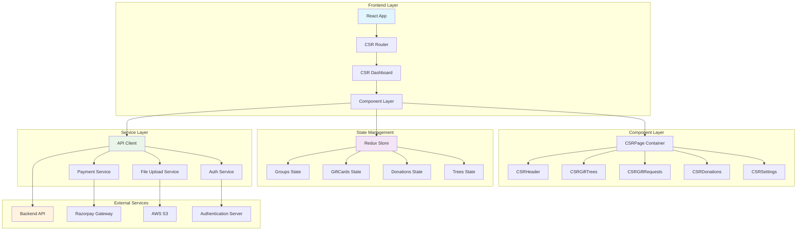
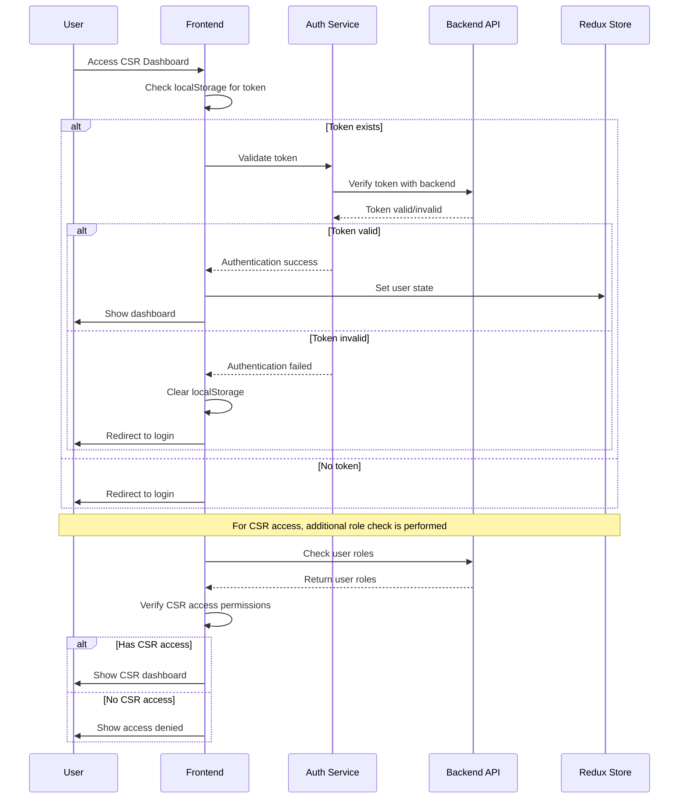
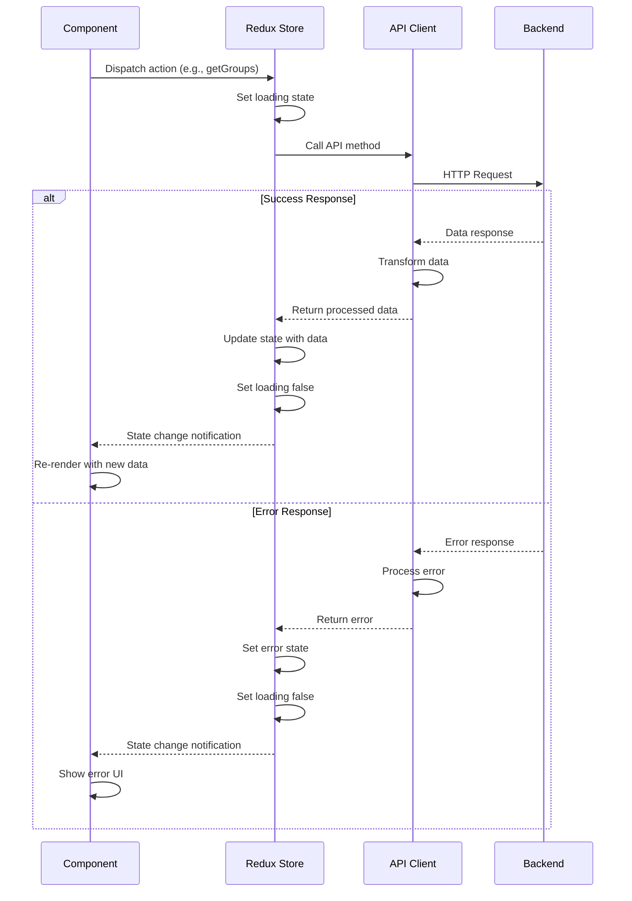
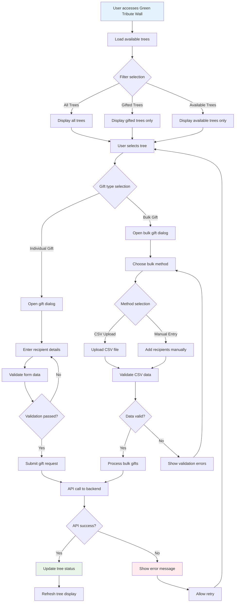
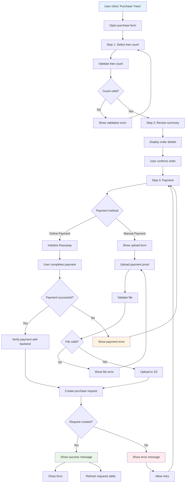
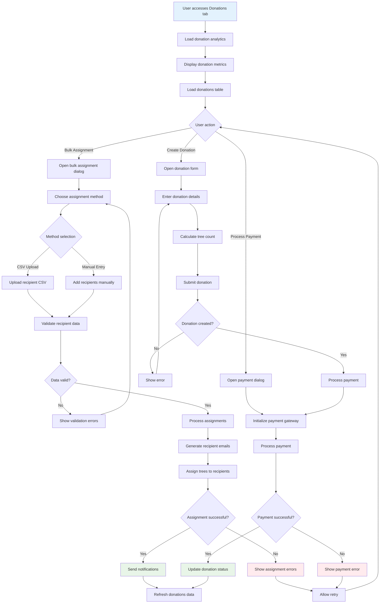
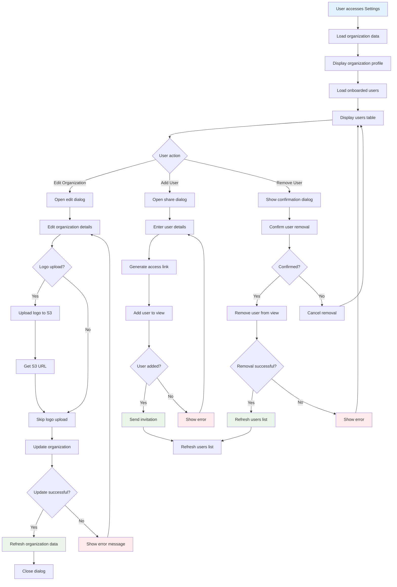
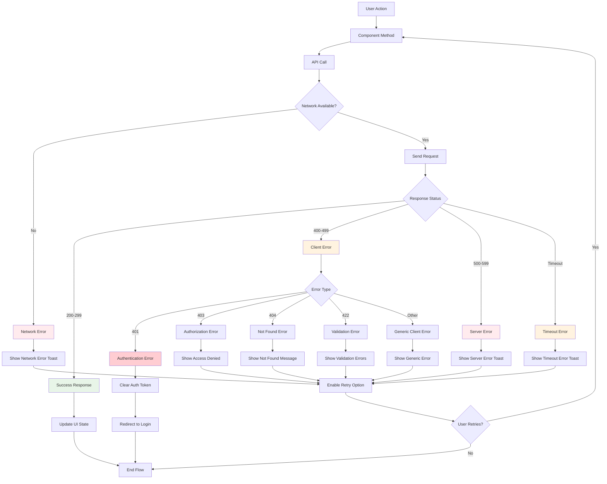
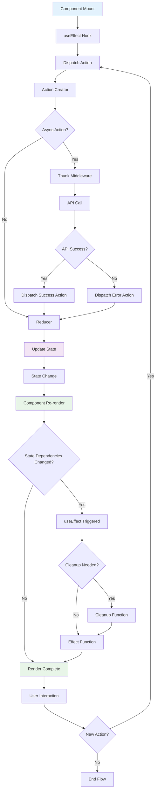
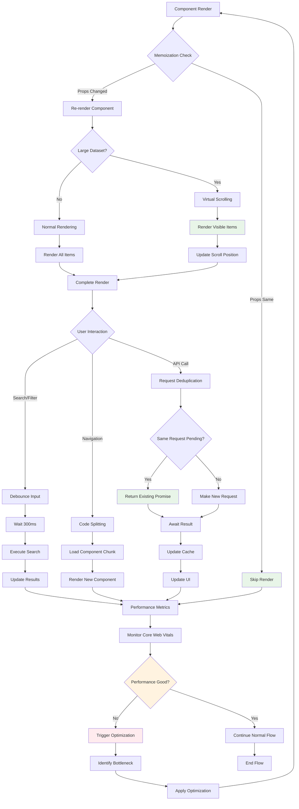

# CSR System Flow Diagrams

## Overview

This document provides visual representations of the CSR system flows, data interactions, and user journeys to help the technical review team understand the system architecture and behavior.

## 1. System Architecture Flow

## 2. User Authentication Flow

## 3. Data Loading Flow

## 4. Gift Tree Workflow

## 5. Purchase Request Flow

## 6. Donation Management Flow

## 7. Settings Management Flow

## 8. Error Handling Flow

## 9. State Management Flow

## 10. Performance Optimization Flow

## Technical Flow Summary

### Key Flow Characteristics

1. **Authentication Flow**: Robust JWT-based authentication with role verification
2. **Data Loading**: Efficient Redux-based state management with error handling
3. **User Interactions**: Comprehensive form validation and user feedback
4. **Error Handling**: Multi-layered error handling with user-friendly messages
5. **Performance**: Optimized rendering with memoization and code splitting

### Flow Optimization Points

1. **Caching Strategy**: API responses cached in Redux store
2. **Debouncing**: Search and filter operations debounced for performance
3. **Code Splitting**: Lazy loading of components for faster initial load
4. **Error Recovery**: Automatic retry mechanisms for failed operations
5. **State Normalization**: Efficient data structure for large datasets

These diagrams provide a comprehensive view of the CSR system's behavior and can help the technical review team understand the complexity and sophistication of the implementation.